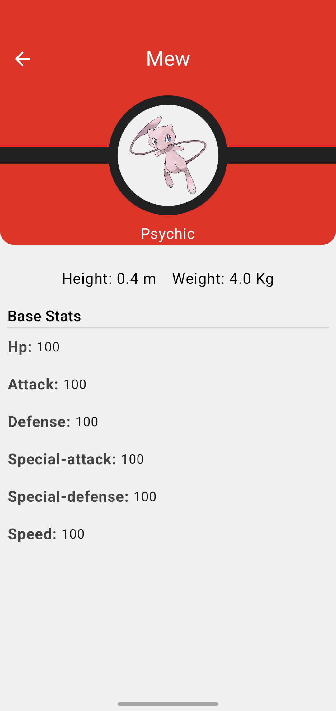

## TheForkChallenge

Neige just got out of school. He read a lot about clean architecture & android.  
He just created this POC based on this [pokemon api](https://pokeapi.co).

He started to create 4 modules:

- A well known `:app` module
- Two features module `search` and `pokemon`.
- The `api` module.

**But he needs your help to improve his skill**

#### Tips
- To help him, **you can add dependencies** you think he would need.
- You **should improve the architecture** where you think it's necessary.
- Each question is more complex than the previous one. Be sure to cover them correctly before going to the next one
- Don't hesitate to look at the FAQ section at the end of that file

#### Time Log
- ---- 1h ---- | Initial architecture and app implementation analysis
- -- 15min - | Figuring out where to put this block
- -- 20min - | Update SearchPresenter to testable implementation
- -- 40min - | Implement Unit tests
- ---- 5h ---- | PokemonActivity design implementation
- ---- 5h ---- | Pokemon module functionality implementation + corresponding design improvements
- ---- 1h ---- | Configuring DI for Pokemon module

### 1st - Architecture:

Can you give him feedback on the architecture of his project?  
You should point out the good things and the issues you found (at least 3 of each).

**Good things:**
- Very initial modularization - logical modules present
- API layer encapsulation with common retrofit logic with its DTOs
- MVP attempt in Search module

**Issues:**
- Current Search module is actually only presentation layer. It should depend on Search-related domain layer, not on common API module directly.
- Tight coupling between Activity and Presenter in search module.
- Direct initialization of service inside API module 
- No domain entities (+mappers) direct DTO usage from presentation layer 
- Hardcoded intent search->pokemon navigation
- No usecases

### 2nd - Unit tests:

He never did any test, and he’s stuck with his `SearchPresenter`.  
Help him improve that class so that it’s testable and write the tests for him.
NB: Do not migrate this SearchPresenter to any other pattern (MVVM, etc), just make it testable and test it 

### 3rd - New activity implementation:

Now, you must help him finish the app by 
- coding the `PokemonActivity.kt`
- plugging it to the `SearchActivity.kt` (you can use his navigation function`navigateToPokemon`).  

For this question you should use [Jetpack Compose](https://developer.android.com/jetpack/compose)
Also, don't hesitate to apply the advices you gave him in question #1

Here is a example of what it could look like

Don't forget to look at the [API](https://pokeapi.co/docs/v2)

### 4th - Navigation:

As you can see, `PokemonActivity.kt` is opened by setting the class name as a string (`"com.thefork.challenge.pokemon.PokemonActivity"`). 
What are the drawbacks of this approach? Neige would like to improve the navigation without creating a dependency between the `:search` and `:pokemon` modules.

Can you explain why?
> ...Your answer...

Could you suggest a solution and even **implement** it?
> ...Your suggested solution...

### Congrats!!

You just reached the end of the test.
Now it's time to zip it and send it back to your contact at TheFork!
We will schedule a technical interview to debrief it ASAP.

### FAQ

**I just downloaded the project, when is the deadline to send it back?**
> There is no real deadline for the submission, however as we receive a lot of candidates, **a "one week" timing is preferred**.

**How much time should I spend on it?**  
> Obviously, the average time spent on the project depend on the profile (junior/senior) and experience with code and libs (kotlin, coroutine, compose, unit testing)  
90% of candidates spend **between 4 and 8 hours**.

**Can I move from MVP to MVVM? or should I stick to the current architecture?**  
> This project is a sand box for you to complete the 4 questions.
We advise you to keep the search module as it is, but feel free to do whatever you want in the `:pokemon` module.
NB: in the end be sure that **your solution answers ALL the questions**.

**Can I create new modules or change module hierarchy?**  
> Yes, but please keep the `:search` and `:pokemon` modules separated to be able to answer question 4.

**The recycler view doesn't have pagination, should I do it? Can I use Android Paging Library?**  
> It's not mandatory within the 4 questions.  
However, if you have time, feel free to show us the pattern you like to implement for infinite scroll (with or without libraries)

**The API contains more information than visible in the UI should I fill the gap?**  
> We consider this test as a way to challenge you on architecture and unit testing from API to UI.  
Mapping more fields, making UI animations, ... won't be our focus points.

**Can I explain my decisions in this Readme file?**
> Of course! We even encourage you to do it:)